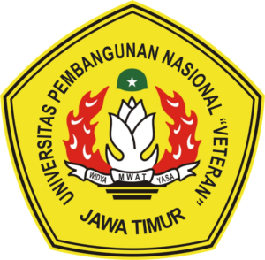

<b>-- PEMROGRAMAN WEBSITE KELOMPOK 11 --</b>

  

 Universitas Pembangunan Nasional “Veteran” Jawa Timur 

 Fakultas Ilmu Komputer 

 Program Studi Sistem Informasi 

Deskripsi Proyek :  
Repositori ini diperuntukkan sebagai wadah pengumpulan dan dokumentasi tugas-tugas mata kuliah Pemrograman Website Kelompok 11. Seluruh kode sumber, laporan, dan aset pendukung dikelola secara terpusat untuk memudahkan kolaborasi dan evaluasi.  
 
Berikut adalah anggota tim, NPM dan username GitHub masing masing anggota:  
 
Dwiki Aulia Rahman (24082010153) @auliadwiki54  
Zaki Wira Laksamana (24082010155) @Revio225  
Hafid Fathurohman	(24082010165) @razorx411  

